# Project Architecture

> **Reverse-engineered from source on 2026-08-24.** Every claim in this document is
> tagged internally as **VERIFIED** (directly observable in source), **INFERRED**
> (strongly implied by interfaces/behaviour), or **UNKNOWN** (not derivable from the
> repository). Section 28 collects the distinctions. Section 27 is the traceability
> matrix mapping each component to concrete files and symbols.

---

## 1. Executive Summary

This repository implements the **Visualping Crawler**: a small, single-purpose,
authenticated web crawler written in pure Python 3.13. Its job is to start at one
password-protected homepage (`http://54.214.7.161/`), traverse **only** resources that
are genuinely reachable from fetched content on that exact host, and extract every
secret matching the pattern `VISUALPING{<16 hex chars>}` — while *provably* terminating
on a site that is deliberately designed to mint an infinite URL space.

**Architectural character:**

- **Style:** A classic **breadth-first-search (BFS) crawler** organised as a clean,
  layered pipeline — Config → Fetch → URL normalisation/scope → Frontier/Visited/Results
  → Discovery → Extraction → (optional) Image/OCR → Engine orchestration → CLI report.
- **Process model:** Single OS process. Default execution is single-threaded; an optional
  `--workers N` flag fans fetches out across a `ThreadPoolExecutor` batch. No async, no
  multiprocessing, no message broker.
- **Persistence:** No database. The only durable output is a flat file `passwords.txt`.
  All crawl state (frontier, visited, results) lives in memory for the run's lifetime.
- **External systems:** Exactly one remote HTTP host (the challenge server) plus one
  optional **out-of-process native binary**, the Tesseract OCR engine, invoked through
  `pytesseract` for pixel-only passwords.
- **No GPU / CUDA / ASIC / FPGA / ROS2 / sensors.** There is no machine-learning model,
  no tensor math, and no numerical stack. "AI/inference" in this project is limited to
  the classical OCR engine. Phases 8/13/14 are therefore mostly *not applicable* and are
  documented as such rather than invented.

**Correctness thesis of the design:** the site plants passwords in unusual carriers
(HTML comments, custom attributes, JS char-code arrays, Base64 blobs, UTF-16 EXIF
metadata, and rendered pixels) and simultaneously plants an *infinite* URL trap
(tracking params + an unbounded `?page=N` feed). The architecture answers both: a
**multi-strategy extractor** for the carriers, and **URL normalisation that strips
volatile parameters** so the frontier can drain to empty and completeness can be proven
(`frontier empty AND discovered ⊆ visited AND no failed fetches`).

**Scale (VERIFIED by inspection):** ~15 first-party Python files (~10 of them
meaningful modules), 17 unit tests, 6 passwords currently recovered against a brief that
advertises 8 (see `docs/REPORT.md`, "Why 6 and not 8").

---

## 2. Repository Structure

```text
POP/                                  # project root
├── main.py                           # CLI entry point + reporting
├── config.py                         # all constants: target, auth, regex, tracking params
├── requirements.txt                  # requests, bs4, lxml, pytest (+ optional pillow, pytesseract)
├── passwords.txt                     # generated output (6 passwords) — gitignored normally
├── README.md                         # short project overview
├── .gitignore
│
├── crawler/                          # core crawler package
│   ├── __init__.py                   # "Crawler building blocks." (namespace only)
│   ├── fetcher.py                    # HTTP layer: Basic Auth, retries, bounded redirects
│   ├── url_utils.py                  # normalize / is_in_scope / make_absolute
│   ├── frontier.py                   # Frontier (FIFO) + Visited + Results state objects
│   ├── discovery.py                  # extract browser-reachable references (HTML/CSS/text)
│   ├── extractor.py                  # password matching: plain, bytes/multi-encoding, encoded
│   └── engine.py                     # Crawler class — BFS orchestration + completeness
│
├── processors/                       # optional content processors
│   ├── __init__.py                   # "Optional content processors."
│   └── image.py                      # byte scan + Tesseract OCR (both optional)
│
├── tests/                            # pytest suite (17 tests)
│   ├── test_url_utils.py             # normalization, scope, tracking-param stripping
│   ├── test_frontier.py             # dedup of pending/visited, example exclusion
│   ├── test_discovery.py            # HTML/text reference extraction
│   └── test_extractor.py            # plain/binary/encoded extraction, header exclusion
│
├── docs/                             # human documentation (not executed)
│   ├── ARCHITECTURE.md               # short layered narrative
│   ├── HOW_TO_RUN.md                 # Windows run + requirement checklist
│   ├── REPORT.md                     # findings report: 6 passwords, decoys, the trap
│   ├── README.md
│   ├── VISUALPING_CRAWLER_REQUIREMENTS.md   # the challenge brief + 10 tasks
│   └── planning/                     # brainstorming, task breakdown, copilot prompts
│
├── .venv/  .venv-1/                  # two local virtualenvs (Python 3.13.5) — NOT source
├── __pycache__/  .pytest_cache/      # caches — ignored
└── .git/
```

### Architectural role of each first-party file

| File | Layer | Role (VERIFIED) |
|------|-------|-----------------|
| `config.py` | Configuration | Single source of truth: `BASE_URL`, `ALLOWED_HOST`, `USERNAME`/`PASSWORD` (Basic Auth), `PASSWORD_REGEX`/`COMPILED_PASSWORD_RE`, `EXAMPLE_PASSWORD`, `MAX_PAGES`, `REQUEST_TIMEOUT`, `USER_AGENT`, and `TRACKING_PARAMS`. Imported almost everywhere. |
| `crawler/fetcher.py` | Infrastructure / Network | The **only** module that touches the network. `fetch()` performs authenticated GET with retries and manual, scope-checked redirect following. `get_content_type()` reads the `Content-Type` header. |
| `crawler/url_utils.py` | Domain / URL policy | `normalize()` (resolve + defragment + strip tracking params), `is_in_scope()` (scheme + exact host), `make_absolute()` (resolve a reference and reject out-of-scope/non-navigable schemes). Enforces the site boundary and collapses the infinite-URL trap. |
| `crawler/frontier.py` | Domain / State | Three in-memory state objects: `Frontier` (deduplicated FIFO deque), `Visited` (normalized set), `Results` (deduplicated password set that drops the example). |
| `crawler/discovery.py` | Domain / Link extraction | Turns a fetched body into a set of in-scope absolute URLs: `extract_from_html()` (BeautifulSoup + lxml), `extract_paths_from_text()` (quoted strings + CSS `url()`), dispatched by `discover_resources()`. |
| `crawler/extractor.py` | Domain / Password extraction | `extract_passwords()` (regex on text), `extract_passwords_from_bytes()` (multi-encoding), `extract_encoded_passwords()` (JS char-code arrays + Base64), `extract_passwords_from_response()` (body only — never headers). |
| `processors/image.py` | Optional processor | `process_image()` — byte scan first, then Tesseract OCR (with a hex-only whitelist and a 2× retry) when the optional stack is installed. |
| `crawler/engine.py` | Application / Orchestration | `Crawler` class: seeds the frontier, runs BFS in bounded batches, routes each response to byte/text/image extraction, enqueues discovered URLs, records credential context, and computes completeness. |
| `main.py` | Presentation / CLI | `argparse` front door; runs the crawler, writes `passwords.txt`, prints the results/stats/completeness report and any flagged credential leaks. |

---

## 3. System Context

**What talks to what (VERIFIED).** The system has one human operator, one remote HTTP
server, one optional local native binary, and one local output file.

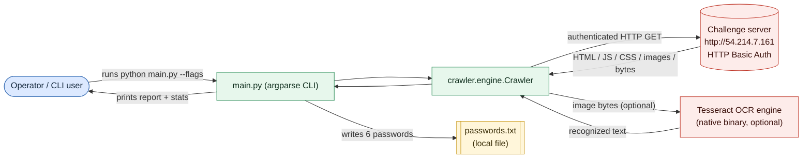

**Boundaries:**

- **Trust boundary:** everything crossing to/from `54.214.7.161` is untrusted input.
  Credentials (`USERNAME`/`PASSWORD`) are sent outbound on every request over **plain
  HTTP** (VERIFIED — `BASE_URL` is `http://`, not `https://`; see §22).
- **Optional boundary:** `pytesseract` shells out to the Tesseract executable; if either
  the Python package or the engine is missing, the image path degrades gracefully to a
  byte-only scan (VERIFIED — `HAS_OCR` / `_TESSERACT_READY` guards).

---

## 4. High-Level Architecture

The system is a **layered pipeline** driven by a BFS loop. Only the layers that actually
exist are shown.

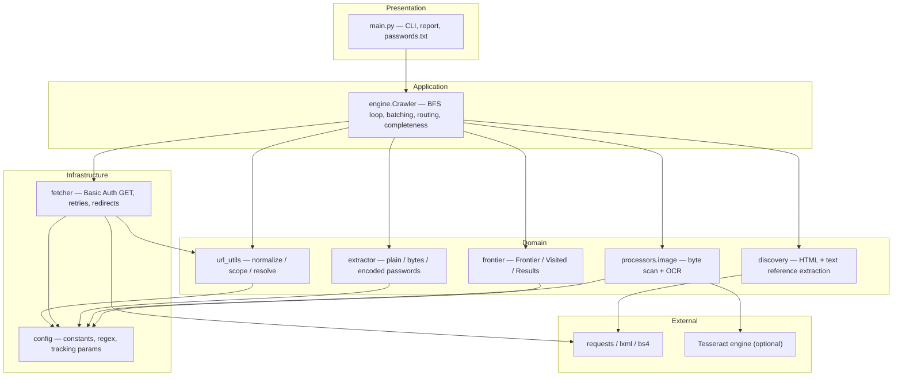

**Key structural facts (VERIFIED):**

- `config.py` is a **leaf** dependency — imported by nearly every module, importing none
  of them. This keeps the dependency graph acyclic.
- `engine.py` is the **composition root** — the only module that imports from all of
  `fetcher`, `url_utils`, `frontier`, `discovery`, `extractor`, and `processors.image`.
- `fetcher.py` is the **sole network egress**; `main.py` is the **sole persistence /
  presentation** point.

---

## 5. Software Architecture

### 5.1 Layer responsibilities

```text
Presentation / CLI     main.py           argparse, run, write passwords.txt, print report
        ↓
Application Services   engine.Crawler    BFS orchestration, batch fetch, response routing,
                                         credential-context flagging, completeness proof
        ↓
Domain / Processing    url_utils         URL normalization + scope policy
                       frontier          Frontier / Visited / Results state
                       discovery         reference (edge) extraction
                       extractor         password extraction strategies
                       processors.image  optional pixel/metadata extraction
        ↓
Infrastructure         fetcher           authenticated HTTP with retries + redirects
                       config            constants and compiled patterns
        ↓
External               requests, bs4/lxml, base64, Tesseract (optional), stdlib urllib
```

### 5.2 Interfaces & communication mechanisms (VERIFIED)

- **In-process function calls only** for internal communication. There is no IPC, no
  queue broker, no socket between components; the "queue" is an in-memory
  `collections.deque` inside `Frontier`.
- **Thread boundary** exists only inside `Crawler.run()` when `workers > 1`: a
  `ThreadPoolExecutor.map(fetch, batch)` runs several `fetch()` calls concurrently. All
  result mutation happens back on the main thread after `list(...)` materialises the
  batch (VERIFIED — see §15 for the concurrency-safety argument).
- **External protocol:** HTTP/1.1 GET with `Authorization: Basic` and a custom
  `User-Agent`, `allow_redirects=False` (redirects handled manually).

### 5.3 Component module diagram

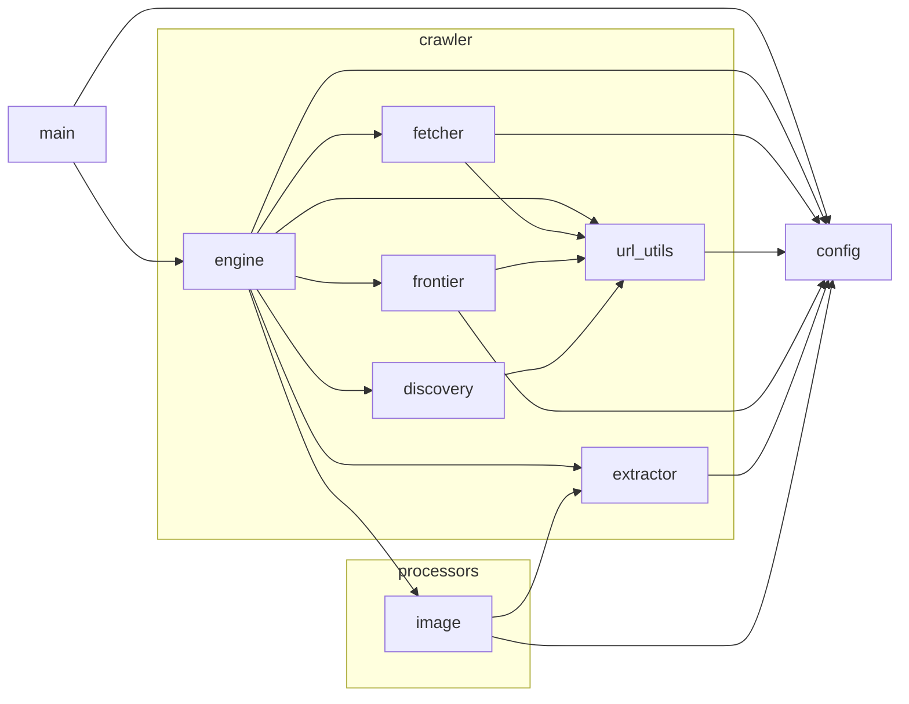

---

## 6. Module Architecture

### 6.1 `config.py` (Configuration)
Constants and one compiled regex. Notable: `TRACKING_PARAMS` is a `frozenset` of
volatile query keys (`utm_*`, `ref`, `v`, `hl`, `sid`, `session`, `gclid`, `fbclid`,
`_`, **`page`**). Stripping `page` is what collapses the unbounded `/report/?page=N`
feed. `COMPILED_PASSWORD_RE = re.compile(r"VISUALPING\{[0-9a-fA-F]{16}\}")`.

### 6.2 `crawler/fetcher.py` (Network)
- `get_content_type(response) -> str` — lower-cased `Content-Type`.
- `fetch(url, retries=3) -> Response | None` — scope-gates the URL, then loops up to **6
  manual redirects**; each hop retries up to `retries+1` times with linear backoff
  (`0.25 * (attempt+1)` s). Non-2xx is **logged but still returned** (bodies of 4xx/5xx
  can carry content); a redirect that leaves scope returns `None`; exhausted retries or
  request exceptions return `None`.

### 6.3 `crawler/url_utils.py` (URL policy)
- `normalize(url, base=None)` — `urljoin` (if base) → `urldefrag` → `urlsplit` → lower
  scheme, keep netloc, default empty path to `/`, `_strip_tracking(query)`, drop
  fragment, `urlunsplit`.
- `_strip_tracking(query)` — drops any key whose lower-case form is in `TRACKING_PARAMS`.
- `is_in_scope(url)` — `scheme ∈ {http,https}` **and** `hostname == ALLOWED_HOST`.
- `make_absolute(base_url, relative)` — rejects empty/`#`/`mailto:`/`javascript:`/`data:`,
  resolves, and returns the URL only if in scope.
- `clean_url` — thin compatibility alias for `normalize`.

### 6.4 `crawler/frontier.py` (State)
- `Visited` — set of normalized URLs; `add`, `__contains__`, `__len__`, `as_set`.
  Membership normalizes on both write and read, so `/page#a` and `/page` collapse.
- `Frontier` — `deque` + `_pending` set (+ optional back-reference to `Visited`).
  `add()` refuses duplicates already pending or visited; `get()` pops FIFO; `empty` /
  `is_empty` / `__len__`.
- `Results` — set of passwords; `add()` rejects `EXAMPLE_PASSWORD`; `update()`, `get_all()`
  (sorted), `__len__`.

### 6.5 `crawler/discovery.py` (Edge extraction)
- `extract_from_html(html, base_url)` — BeautifulSoup(`lxml`). Pulls standard resource
  attributes (`a/href`, `img/src`, `script/src`, `link/href`, `iframe/src`, `form/action`,
  `source/src`, `video/src`, `audio/src`), every `data-*` attribute, inline `style`
  `url(...)`, and `<style>` block `url(...)`.
- `extract_paths_from_text(text, base_url)` — quoted strings (`QUOTED_REF_RE`) and CSS
  `url()` values that look path-like (`/`, `./`, `../`, `http(s)://`).
- `discover_resources(content, base_url, content_type)` — HTML path if `"html"` in the
  content type, else generic text path.

### 6.6 `crawler/extractor.py` (Password extraction)
- `extract_passwords(text)` — regex `findall`, minus the example.
- `extract_passwords_from_response(response)` — **body only** (`response.text`); headers
  are deliberately never inspected (challenge rule).
- `extract_passwords_from_bytes(data)` — decodes under `utf-8`, `utf-16-le`, `utf-16-be`,
  `latin-1` (errors ignored) and unions the matches. Defeats UTF-16 EXIF hiding.
- `extract_encoded_passwords(text)` — decodes JS `String.fromCharCode`-style char-code
  arrays (`_CHARCODE_ARRAY_RE`, ≥7 numbers) and Base64 tokens (`_BASE64_TOKEN_RE`,
  validated), then re-applies the extractors. Guards against false positives via strict
  validation.

### 6.7 `processors/image.py` (Optional OCR)
- Import-guarded (`HAS_OCR`) and engine-guarded (`_TESSERACT_READY` via
  `_locate_tesseract()`, which checks `PATH` and three well-known Windows install paths).
- `process_image(url, content)` — byte scan first (cheap, always runs); if nothing and
  OCR is ready, run Tesseract with `--psm 7` and a `VISUALPING{}`+hex whitelist; if still
  nothing, retry once on a grayscale 2× upscale. All exceptions swallowed so a bad image
  never crashes the crawl.

### 6.8 `crawler/engine.py` (Orchestration)
`Crawler` holds all state (`visited`, `frontier`, `results`, `discovered`,
`credential_leaks`, `failed`, `pages_fetched`). `run()` executes BFS in batches of size
`workers`; `_process_response()` routes each response; `_enqueue()` scope-filters and
normalizes; `_record_credential_context()` flags passwords sitting within ±160 chars of
`admin_password`/`fixme`; `get_stats()` returns counters and the boolean `complete`.

### 6.9 `main.py` (CLI)
`argparse` (`--max-pages`, `--workers`, `--verbose`), timing via `time.monotonic()`,
writes `passwords.txt`, prints results/stats/completeness and any credential leaks,
returns process exit code `0`.

---

## 7. Data Architecture

Major data objects, their origin, type, transformation, and destination (VERIFIED):

| Object | Origin | Type / shape | Transform | Consumer / destination | Lifetime |
|--------|--------|--------------|-----------|------------------------|----------|
| **URL** | seed (`config.BASE_URL`) or discovered edge | `str` (normalized) | `normalize()` / `make_absolute()` | `Frontier`, `fetch()` | whole run (in `Visited`/`discovered`) |
| **HTTP response** | `fetch()` via `requests` | `requests.Response` | header + body access | `_process_response()` | one iteration |
| **Raw body bytes** | `response.content` | `bytes` | multi-encoding decode | `extract_passwords_from_bytes()`, `process_image()` | one iteration |
| **Decoded text** | `response.text` / fallback decode | `str` | regex / parse | discovery + extractor | one iteration |
| **Content type** | `Content-Type` header | `str` | lower-case, prefix test | routing in engine + discovery | one iteration |
| **Discovered refs** | discovery functions | `set[str]` | scope filter + normalize | `_enqueue()` → `Frontier` | one iteration |
| **Password** | extractor / image | `str` matching regex | dedup, example-exclusion | `Results` → `passwords.txt` + stdout | whole run |
| **Credential-leak flag** | `_record_credential_context()` | `set[str]` | context window scan | final report | whole run |
| **Image** | `response.content` (image/*) | `bytes` → `PIL.Image` | grayscale/2× upscale, OCR | `extract_passwords()` on OCR text | one iteration |
| **Stats** | `get_stats()` | `dict[str, int|bool]` | aggregation | `main.py` report | end of run |

**Stores:** exactly one durable store — `passwords.txt` (UTF-8, one password per line,
sorted). Everything else is transient RAM. **No database, no cache file, no serialized
crawl state.** (VERIFIED.)

---

## 8. Data Flow

### 8.1 High-level data flow

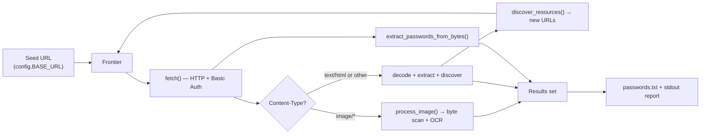

### 8.2 Detailed data flow (functions/files)

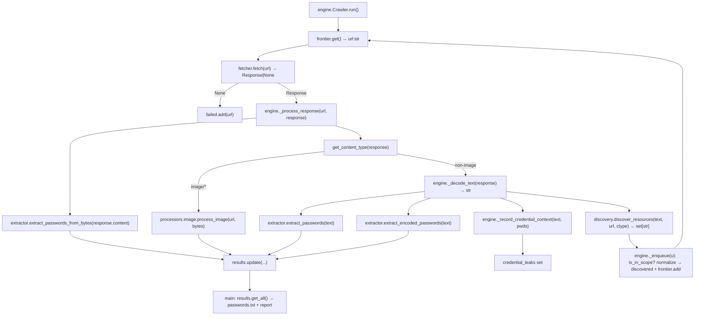

### 8.3 Data lifecycle

```text
URL:       Created (seed/discovery) → Normalized → Deduplicated (Frontier/Visited)
           → Fetched → discarded from frontier (kept in visited/discovered sets)

Body:      Received (bytes) → Decoded (text) → Scanned (multiple strategies)
           → discarded after the iteration (not stored)

Password:  Extracted → Example-filtered & Deduplicated (Results set)
           → Sorted → Persisted (passwords.txt) + Printed → end of process
```

---

## 9. Runtime Execution Flow

Canonical trace for `python main.py` (single-worker default):

```text
INPUT            argv flags (--max-pages, --workers, --verbose)
  ↓
ENTRY POINT      main.main()                              main.py:9
  ↓
INITIALIZATION   Crawler(verbose=...)                     engine.py:25  (seeds frontier + discovered)
  ↓
CONFIGURATION    config.* constants imported at load      config.py
  ↓
CORE LOOP        Crawler.run(max_pages, workers)          engine.py:38
     while frontier not empty and pages_fetched < limit:
       build batch (size = workers) of unvisited URLs
       fetch batch (serial if workers==1, else ThreadPool)
       for each (url, response): _process_response()
  ↓
DATA TRANSFORM   decode bytes/text; parse HTML; decode encoded carriers
  ↓
"MODEL"/ALGO     regex match + Base64/char-code decode + (optional) Tesseract OCR
  ↓
OUTPUT           Results.get_all() (sorted, example excluded)
  ↓
STORAGE/DISPLAY  write passwords.txt; print report + stats + completeness + leaks
```

**Termination conditions (VERIFIED, `engine.py:42`):** the loop stops when the frontier
is empty **or** `pages_fetched` reaches the page limit. Completeness (`get_stats()['complete']`)
is `True` only if frontier is empty **and** there are no failed fetches **and**
`discovered ⊆ visited`.

---

## 10. Call Graph

Architecturally meaningful paths (trivial helpers omitted):

```mermaid
flowchart TB
    main["main.main()"] --> ctor["Crawler.__init__()"]
    main --> run["Crawler.run()"]
    main --> stats["Crawler.get_stats()"]
    main --> getall["Results.get_all()"]

    ctor --> norm1["url_utils.normalize()"]
    ctor --> fadd["Frontier.add()"]

    run --> fget["Frontier.get()"]
    run --> vadd["Visited.add()"]
    run --> fetch["fetcher.fetch()"]
    run --> proc["Crawler._process_response()"]

    fetch --> scope["url_utils.is_in_scope()"]
    fetch --> mkabs["url_utils.make_absolute()"]
    fetch --> req["requests.get()"]

    proc --> gct["fetcher.get_content_type()"]
    proc --> exb["extractor.extract_passwords_from_bytes()"]
    proc --> pimg["processors.image.process_image()"]
    proc --> dec["Crawler._decode_text()"]
    proc --> exp["extractor.extract_passwords()"]
    proc --> exe["extractor.extract_encoded_passwords()"]
    proc --> rec["Crawler._record_credential_context()"]
    proc --> disc["discovery.discover_resources()"]
    proc --> enq["Crawler._enqueue()"]

    disc --> exhtml["extract_from_html()"]
    disc --> extext["extract_paths_from_text()"]
    exhtml --> mkabs
    extext --> mkabs
    pimg --> ocr["pytesseract.image_to_string()"]
    enq --> scope
    enq --> norm2["url_utils.normalize()"]
    enq --> fadd
```

---

## 11. Sequence Diagrams

### 11.1 Startup / seeding

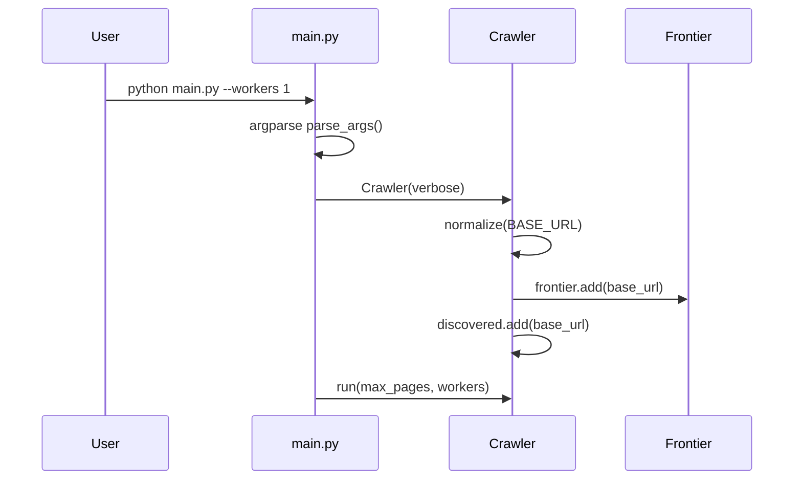

### 11.2 Single-worker fetch + process iteration

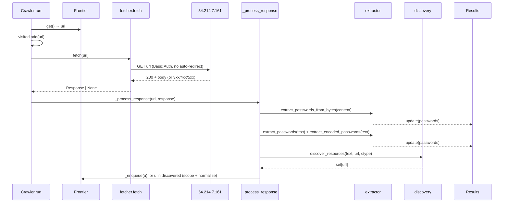

### 11.3 Parallel batch fetch (`--workers N`)

```mermaid
sequenceDiagram
    participant C as Crawler.run
    participant F as Frontier
    participant T as ThreadPoolExecutor
    participant Fe as fetch (xN threads)
    participant Site as 54.214.7.161

    loop build batch (≤ N urls)
        C->>F: get() → url ; visited.add(url)
    end
    C->>T: executor.map(fetch, batch)
    par one thread per url
        T->>Fe: fetch(url_i)
        Fe->>Site: GET url_i
        Site-->>Fe: Response_i
    end
    Fe-->>C: list(zip(batch, responses))
    Note over C: results/discovery mutated<br/>on main thread only (after map)
    loop for each (url, response)
        C->>C: _process_response(url, response)
    end
```

### 11.4 Image / OCR path

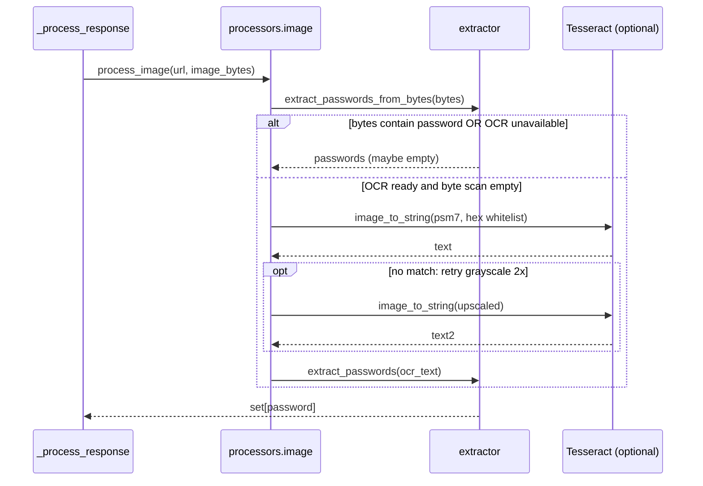

### 11.5 Redirect + retry (error/recovery)

```mermaid
sequenceDiagram
    participant C as Crawler
    participant Fe as fetch
    participant Site as Server
    C->>Fe: fetch(url)
    loop up to 6 redirects
        loop up to retries+1 attempts
            Fe->>Site: GET current_url
            alt RequestException
                Fe->>Fe: sleep 0.25*(n+1), retry
            else got response
                Fe-->>Fe: break
            end
        end
        alt 3xx redirect
            Fe->>Fe: make_absolute(Location)
            alt out of scope
                Fe-->>C: None (rejected)
            else in scope
                Fe->>Fe: current_url = next ; continue
            end
        else 2xx/4xx/5xx
            Fe-->>C: response (non-2xx logged)
        end
    end
```

### 11.6 Shutdown / reporting

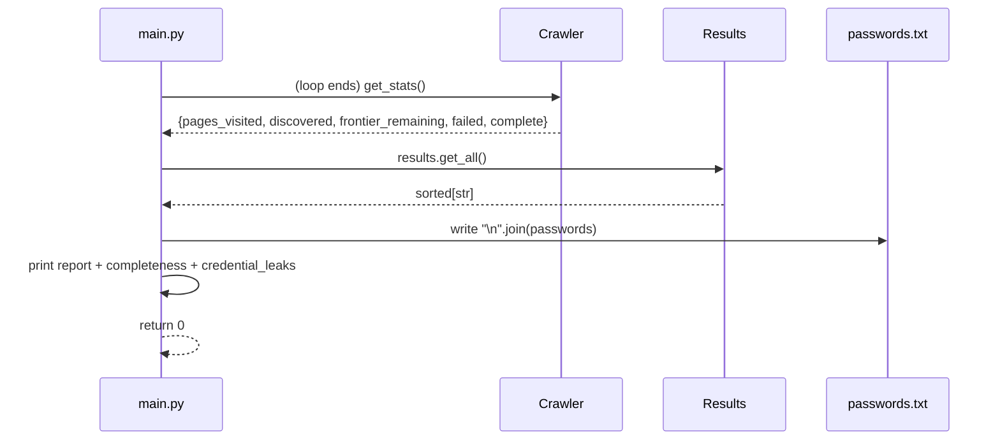

---

## 12. Hardware Architecture

**Not applicable in the embedded/sensor sense.** This is a pure userland network
application. There is **no** sensor, camera, LiDAR, SPI/I2C/UART, GPIO, FPGA, PCIe, or
microcontroller interaction anywhere in the repository (VERIFIED — no such imports,
device paths, or SDKs exist).

The only "hardware-adjacent" element is the **optional Tesseract OCR engine**, a native
executable invoked out-of-process:

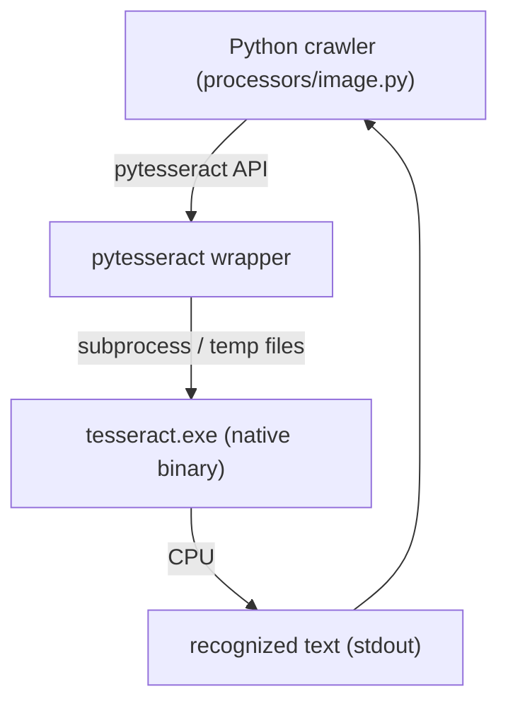

> **Internal ASIC/hardware implementation is not visible in the software repository** —
> because there is none to be visible. OCR runs on the CPU via the Tesseract binary.

---

## 13. ASIC / FPGA / GPU Architecture

**None present. UNKNOWN → resolved to "does not exist."**

- No CUDA, no `torch`/`tensorflow`/`onnxruntime`, no `cupy`, no OpenCL, no GPU device
  selection, no ASIC/FPGA register maps, no HDL, no bitstreams (VERIFIED — absent from
  `requirements.txt` and all imports).
- Tesseract's OCR *could* be seen as a classical algorithm accelerator, but as invoked
  here it is a **CPU-only** subprocess with no GPU offload configured.

There is therefore no meaningful `Physical Sensor → AFE → ADC/TDC → ASIC/FPGA → Driver`
chain to reverse-engineer. Stating otherwise would be fabrication.

---

## 14. CPU/GPU/CUDA Architecture

All computation is **CPU-only, in the CPython interpreter** (VERIFIED). The performance
profile is I/O-bound (network round-trips), with modest CPU cost in `lxml` HTML parsing
and regex scanning.

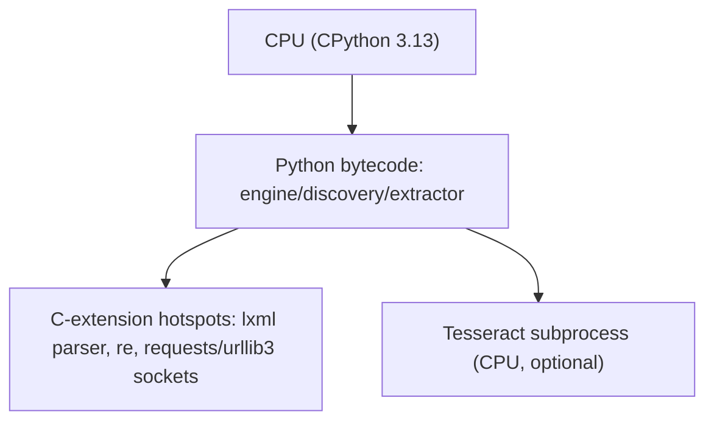

There is **no** `CPU → Python → CUDA/C++ → GPU → Kernel → GPU Memory` path; the CUDA
template from the prompt does not apply here.

---

## 15. Concurrency Architecture

**Model (VERIFIED):**

- **Default:** fully single-threaded. `workers=1` → `responses = [(batch[0], fetch(batch[0]))]`.
- **Optional parallel fetch:** `workers>1` → a fresh `ThreadPoolExecutor(max_workers=workers)`
  per batch, `executor.map(fetch, batch)` materialised with `list(...)`. Only the
  **network fetch** runs in threads; **all shared-state mutation** (`visited`,
  `results`, `discovered`, `frontier`) happens on the main thread *after* the batch
  completes.

```mermaid
flowchart LR
    subgraph MainThread
        Loop["run() batch loop"]
        Sets["visited / results / discovered / frontier"]
        Proc["_process_response()"]
    end
    subgraph Pool["ThreadPool (per batch, workers>1)"]
        W1["fetch(url1)"]
        W2["fetch(url2)"]
        Wn["fetch(urlN)"]
    end
    Loop -->|dispatch batch| Pool
    W1 --> Net["requests → server"]
    W2 --> Net
    Wn --> Net
    Pool -->|list(zip(...))| Proc
    Proc --> Sets
    Sets --> Loop
```

**Concurrency assessment:**

- **Race safety (INFERRED, well-supported):** worker threads only call `fetch()`, which
  reads shared config and does network I/O but does **not** mutate crawler state. The
  batch is drained from the frontier *before* dispatch, and results are folded in
  serially afterward, so there is no concurrent writer to the sets. No locks are needed
  and none are used.
- **Duplicate-fetch corner case (INFERRED):** because a whole batch is marked visited
  before fetching, dedup across a batch is fine; correctness does not depend on ordering.
- **Bottlenecks (INFERRED):** the dominant cost is HTTP latency; `--workers` directly
  targets it. Secondary CPU cost is `BeautifulSoup(html, "lxml")` per HTML page and the
  four-encoding byte decode of every response. A new `ThreadPoolExecutor` is created and
  torn down **per batch** (minor overhead; VERIFIED at `engine.py:52`).
- **Blocking ops:** `requests.get(timeout=REQUEST_TIMEOUT=10s)` and `time.sleep()` backoff;
  both occur on worker threads (or the main thread when single-worker).

---

## 16. External Interfaces

| Interface | Direction | Mechanism | Evidence |
|-----------|-----------|-----------|----------|
| Challenge web server | outbound | HTTP/1.1 GET, Basic Auth, custom UA, manual redirects, 10 s timeout | `fetcher.fetch()` |
| Tesseract OCR | outbound (optional) | `pytesseract.image_to_string` → native subprocess | `processors/image.py` |
| Filesystem | outbound | `open("passwords.txt","w")` | `main.py` |
| CLI | inbound | `argparse` (`--max-pages`, `--workers`, `--verbose`) | `main.py` |
| stdout / logging | outbound | `print()` + `logging` (INFO when `--verbose`) | `main.py`, module loggers |

No inbound network interface, no REST/gRPC server, no message queue, no webhook.

---

## 17. Database / Storage Architecture

**There is no database.** (VERIFIED.) Storage is limited to:

- **`passwords.txt`** — the sole durable artifact; overwritten each run with the sorted,
  deduplicated, example-excluded password list (UTF-8).
- **In-memory sets/deque** — `Visited._items`, `Frontier._queue`/`_pending`,
  `Results._items`, `Crawler.discovered`/`credential_leaks`/`failed`. All discarded at
  process exit.

```mermaid
flowchart LR
    Results["Results set (RAM)"] -->|get_all() sorted| Write["main.py open(w)"]
    Write --> TXT[["passwords.txt (UTF-8)"]]
```

---

## 18. Dependency Architecture

### Direct runtime dependencies (VERIFIED from `requirements.txt` + imports)

| Package | Used by | Purpose |
|---------|---------|---------|
| `requests>=2.31` | `fetcher.py` | HTTP client, Basic Auth, redirects, timeouts |
| `beautifulsoup4>=4.12` | `discovery.py` | HTML parsing / tag traversal |
| `lxml>=4.9` | `discovery.py` (parser backend) | Fast, lenient HTML parser for BeautifulSoup |
| `pillow>=10.0` *(optional)* | `processors/image.py` | Decode/resize images for OCR |
| `pytesseract>=0.3.10` *(optional)* | `processors/image.py` | Bridge to the Tesseract engine |

### Standard library (VERIFIED)
`argparse`, `logging`, `time`, `re`, `base64`, `binascii`, `os`, `shutil`, `io.BytesIO`,
`collections.deque`, `concurrent.futures.ThreadPoolExecutor`, `urllib.parse.*`.

### System dependency
- **Tesseract OCR engine** (native, optional) — required only for the pixel-only image
  password; the crawler runs and reports without it.

### Development dependencies
- `pytest>=7.4` — 17 unit tests in `tests/`.

### Transitive (INFERRED)
`requests` → `urllib3`, `certifi`, `idna`, `charset-normalizer`; `beautifulsoup4` →
`soupsieve`.

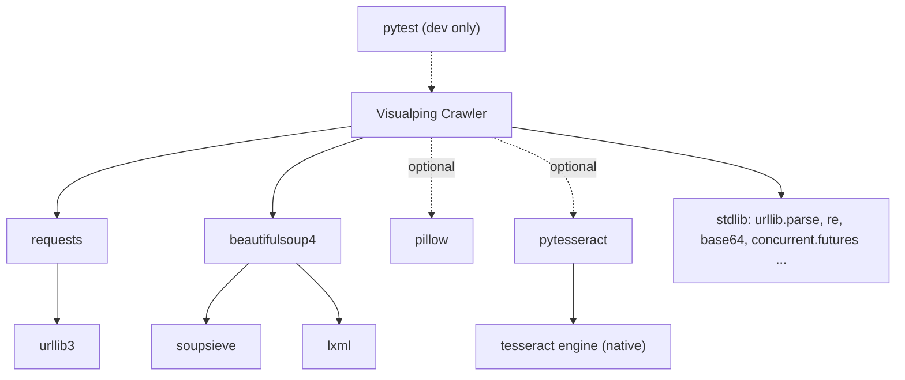

---

## 19. Deployment Architecture

**Runtime assumptions (VERIFIED / INFERRED):**

- **OS:** developed on Windows 11 (`docs/HOW_TO_RUN.md` PowerShell, Windows Tesseract
  paths in `image.py`). Portable to Linux/macOS — no Windows-only APIs are used in the
  crawler core (INFERRED).
- **Python:** 3.13 (VERIFIED — both `.venv` report `3.13.5`; type syntax `str | None`,
  `set[str]` requires 3.10+).
- **Isolation:** local virtualenv (`python -m venv .venv`); two venvs (`.venv`, `.venv-1`)
  present in the tree.
- **No Docker, no service, no ports, no env vars.** All configuration is hard-coded
  constants in `config.py` (VERIFIED — no `os.environ` reads for config). `.gitignore`
  anticipates a `.env` but none is loaded by code.
- **Startup command:** `python main.py [--max-pages N] [--workers N] [--verbose]`.
- **Hardware needs:** ordinary CPU + network egress to `54.214.7.161`; optional Tesseract
  binary for full image coverage.

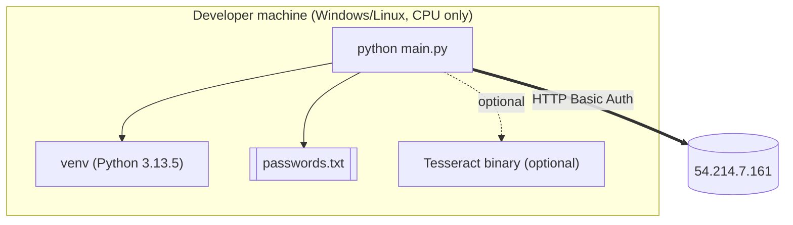

---

## 20. Error and Recovery Architecture

**Strategy: fail-soft everywhere; never let one bad resource abort the crawl.** (VERIFIED.)

| Failure | Handling | Location |
|---------|----------|----------|
| Transient network error | retry up to `retries+1` with linear backoff; then raise→caught→`None` | `fetcher.fetch()` |
| Too many redirects (>6) | log warning, return `None` | `fetcher.fetch()` |
| Redirect leaving scope | log, return `None` (URL dropped) | `fetcher.fetch()` |
| Non-2xx status | logged, **body still returned** and scanned | `fetcher.fetch()` |
| `fetch()` returns `None` | `failed.add(url)`; marks crawl incomplete | `engine._process_response()` |
| Undecodable text body | fall back to `content.decode("utf-8", errors="ignore")` | `engine._decode_text()` |
| Malformed Base64 / char-code | `try/except (ValueError, binascii.Error)` → skip | `extractor.extract_encoded_passwords()` |
| Missing OCR stack | `HAS_OCR=False` / `_TESSERACT_READY=False` → skip OCR | `processors/image.py` |
| Unreadable image / OCR crash | broad `except Exception` → return empty set | `processors/image.py` |

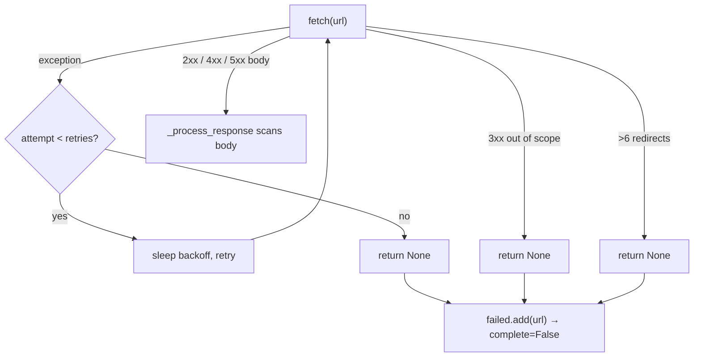

**Recovery semantics:** any `None` from `fetch` records a *failed fetch*, which the
completeness predicate treats as blocking (`complete` requires `not self.failed`). So the
design prefers to honestly report "incomplete" rather than silently skip.

---

## 21. Performance Architecture

**Profile: network-latency-bound.** (INFERRED, well-supported.)

- **Primary lever:** `--workers` parallelises HTTP round-trips inside each batch.
- **Normalisation is the correctness *and* performance win:** stripping `TRACKING_PARAMS`
  (esp. `page`) collapses the infinite `/report/?page=N` and `utm/ref/v/hl` variants, so
  the frontier is finite (~541 resources per `docs/REPORT.md`) instead of unbounded.
- **Per-resource CPU costs:** `BeautifulSoup(html, "lxml")` per HTML page; a **4-encoding**
  full-body decode (`utf-8/utf-16-le/utf-16-be/latin-1`) for **every** response, even
  large binaries (a redundant-work hotspot — see §25); regex `findall` on each decode.
- **Minor overheads:** a new `ThreadPoolExecutor` per batch; `Visited`/`Frontier`
  normalise URLs on every membership check.

**Performance-critical path:** `run()` → `fetch()` (network) → `_process_response()` →
`extract_passwords_from_bytes()` + `BeautifulSoup` parse. OCR, when triggered, is the
single most expensive per-resource operation but runs only on images that fail the byte
scan.

---

## 22. Security Considerations

Grounded in the code (not theoretical):

1. **Plaintext credentials over HTTP (VERIFIED).** `BASE_URL="http://…"` and
   `auth=(USERNAME, PASSWORD)` mean the Basic Auth credentials are sent base64-encoded
   over an unencrypted channel on every request. Acceptable for a fixed challenge target;
   would be a real finding against production.
2. **Hard-coded secrets in `config.py` (VERIFIED).** `USERNAME`/`PASSWORD` are committed
   to source control. `.gitignore` reserves `.env` but no code reads it.
3. **SSRF surface is tightly bounded (VERIFIED, positive).** `is_in_scope()` pins scheme
   to http/https and host to the exact `ALLOWED_HOST`; redirects are followed manually and
   re-checked; `mailto:`/`javascript:`/`data:` are rejected. The crawler cannot be steered
   off-host by malicious links or redirects.
4. **Untrusted-content parsing (INFERRED).** Responses are parsed with `lxml` and decoded
   defensively; `eval`/`exec`/pickle are never used, so remote content cannot execute.
5. **Base64/char-code decoding is validated (VERIFIED).** Strict validation and try/except
   prevent decoder crashes and false positives, but arbitrary remote bytes are still
   decoded in-memory (DoS-by-size is not bounded beyond `REQUEST_TIMEOUT`).
6. **No TLS verification concerns** because no HTTPS is used to the target; `requests`
   default verification would apply if the scheme were https.

---

## 23. Architecture Strengths

- **Clean layering & acyclic dependencies** — `config` is a pure leaf; `engine` is the
  single composition root; each module has one clear responsibility.
- **Provable termination** — completeness is a first-class, explicitly computed predicate,
  not a vibe. The infinite-URL trap is defeated by principled normalisation.
- **Defense-in-depth extraction** — plain text, multi-encoding bytes, JS char-code arrays,
  Base64, and OCR cover every carrier the site uses, without inventing false positives.
- **Fail-soft I/O** — no single resource can abort the crawl; failures are counted and
  surfaced honestly.
- **Optionality done right** — OCR degrades gracefully via import/engine guards; the core
  never hard-depends on Pillow/Tesseract.
- **Testability** — pure functions (`normalize`, `extract_*`, discovery) are unit-tested
  (17 tests) without network access.

---

## 24. Architecture Weaknesses

- **Redundant work per response** — `extract_passwords_from_bytes()` runs a 4-encoding
  decode over **every** response body (including already-decoded HTML and large images),
  duplicating effort with the text path.
- **Per-batch executor churn** — a `ThreadPoolExecutor` is created/destroyed for each
  batch of size `workers`, rather than one pool for the run.
- **Untyped `response` parameter** — `_process_response(self, url, response)` and
  `_decode_text` accept an untyped object; the fetch contract (`Response | None`) is only
  informally honoured.
- **Config as code** — no environment/secret separation; changing target or credentials
  means editing source.
- **Dead/compatibility surface** — `clean_url`, `Frontier.is_empty`,
  `extract_passwords_from_response` (used only in tests) are compatibility shims that add
  minor noise.
- **Single output format** — results are only a flat text file + stdout; no JSON/structured
  export for downstream tooling.

---

## 25. Technical Debt

- **`_BYTE_ENCODINGS` full-body re-decode** for binary payloads is wasteful and could scan
  megabyte images four times (bounded only by content size). (`extractor.py:23-31`.)
- **Two virtualenvs committed-adjacent** (`.venv`, `.venv-1`) suggest environment drift;
  neither is source but both bloat the tree.
- **Compatibility aliases** (`clean_url`, `is_empty`) indicate an earlier API that moved;
  worth pruning.
- **Credential-context heuristic is string-proximity only** (`±160` chars around
  `admin_password`/`fixme`), which is pragmatic but brittle to markup spacing.
- **`page` treated as a tracking param** is correct *for this site only*; it is a
  site-specific assumption baked into shared config, documented but not parameterised.

---

## 26. Risks

| Risk | Type | Likelihood | Impact | Notes |
|------|------|-----------|--------|-------|
| Target site content rotates | External | Medium | Recovers <8 passwords | Already observed: 6/8 (see `docs/REPORT.md`, "Why 6 and not 8") |
| Plaintext auth over HTTP | Security | Certain (by design) | Credential exposure on-wire | Challenge-scoped |
| Tesseract absent | Operational | Medium | Misses pixel-only password | Graceful skip, reported |
| Very large binary responses | Performance | Low | 4× decode cost / memory | No max-size guard beyond timeout |
| Normalisation drops a *meaningful* param | Correctness | Low | Misses a distinct resource | Mitigated: only volatile keys stripped; `q` preserved (tested) |
| Non-HTML text with password behind headers only | Correctness | N/A | Intentionally ignored | Challenge rule; decoys excluded |

---

## 27. Traceability Matrix

| Architecture Component | Source | Symbol | Evidence |
|------------------------|--------|--------|----------|
| CLI entry / reporting | `main.py:9` | `main()` | Parses args, runs crawler, writes `passwords.txt`, prints report |
| BFS orchestration | `crawler/engine.py:22` | `Crawler` / `run()` | Batched loop until frontier empty or page limit |
| Response routing | `crawler/engine.py:59` | `Crawler._process_response()` | Byte scan + image/text branch + enqueue |
| Completeness proof | `crawler/engine.py:111` | `Crawler.get_stats()` | `complete = frontier empty AND no failed AND discovered⊆visited` |
| Credential-leak flag | `crawler/engine.py:101` | `_record_credential_context()` | ±160-char scan for `admin_password`/`fixme` |
| Authenticated fetch | `crawler/fetcher.py:20` | `fetch()` | `requests.get(auth=(USER,PASS), allow_redirects=False)` + retries |
| Content-type read | `crawler/fetcher.py:15` | `get_content_type()` | Lower-cased `Content-Type` header |
| URL normalization | `crawler/url_utils.py:15` | `normalize()` | defrag + tracking-param strip + canonical form |
| Scope enforcement | `crawler/url_utils.py:24` | `is_in_scope()` | scheme∈{http,https} AND host==ALLOWED_HOST |
| Reference resolution | `crawler/url_utils.py:30` | `make_absolute()` | Rejects `mailto/js/data`, resolves, scope-checks |
| Frontier (queue) | `crawler/frontier.py:28` | `Frontier` | deque + pending/visited dedup |
| Visited set | `crawler/frontier.py:9` | `Visited` | Normalized membership |
| Results set | `crawler/frontier.py:63` | `Results` | Dedup + example exclusion |
| HTML discovery | `crawler/discovery.py:20` | `extract_from_html()` | Tags, `data-*`, inline+block CSS `url()` |
| Text discovery | `crawler/discovery.py:48` | `extract_paths_from_text()` | Quoted paths + CSS urls |
| Plain extraction | `crawler/extractor.py:10` | `extract_passwords()` | Regex `findall`, minus example |
| Header exclusion | `crawler/extractor.py:15` | `extract_passwords_from_response()` | Reads `response.text` only |
| Binary extraction | `crawler/extractor.py:26` | `extract_passwords_from_bytes()` | utf-8/utf-16/latin-1 union (UTF-16 EXIF) |
| Encoded extraction | `crawler/extractor.py:41` | `extract_encoded_passwords()` | char-code arrays + Base64 |
| Image / OCR | `processors/image.py:51` | `process_image()` | Byte scan → Tesseract `--psm 7` hex whitelist → 2× retry |
| Tesseract locate | `processors/image.py:25` | `_locate_tesseract()` | PATH + Windows install-path probing |
| Config / trap fix | `config.py:16` | `TRACKING_PARAMS` | Strips `utm_*/ref/v/hl/page` to bound frontier |
| Password pattern | `config.py:8` | `COMPILED_PASSWORD_RE` | `VISUALPING\{[0-9a-fA-F]{16}\}` |
| Persistence | `main.py:25` | `open("passwords.txt","w")` | Sorted password list to disk |
| Parallel fetch | `crawler/engine.py:52` | `ThreadPoolExecutor` | `executor.map(fetch, batch)` |

---

## 28. Verified vs Inferred vs Unknown

### VERIFIED (directly in source)
- Layering, module responsibilities, and the acyclic `config`-as-leaf dependency shape.
- Single-process; single-thread default; optional `ThreadPoolExecutor` for fetches only.
- Only network egress is `requests.get` in `fetcher.py` to one host with Basic Auth over HTTP.
- No DB; single durable output `passwords.txt`.
- Multi-strategy extraction (plain / bytes multi-encoding / char-code / Base64 / OCR).
- Completeness predicate and fail-soft error handling.
- Tracking-parameter stripping (incl. `page`) as the anti-infinite-URL mechanism.
- Python 3.13.5 venvs; no Docker/env-var config; no GPU/ASIC/sensor code.

### INFERRED (strongly supported, not literally stated)
- Thread-safety of the parallel path (no shared-state mutation inside `fetch`; mutation
  serialised on the main thread after `list(map(...))`).
- I/O-bound performance profile and the 4-encoding decode as a CPU hotspot.
- Cross-platform portability of the crawler core (Windows-specific bits are OCR path only).
- Transitive dependency set (`urllib3`, `soupsieve`, etc.).

### UNKNOWN (not derivable from the repository)
- The **server-side** structure of `54.214.7.161` (its routes, why 2 of 8 passwords are
  currently unreachable) — only observable behaviour is documented in `docs/REPORT.md`.
- Whether any CI/CD or scheduled execution wraps this crawler (no workflow files present).
- Any ASIC/FPGA/sensor internals — **none exist in this repository**; there is no hidden
  hardware layer to reverse-engineer.

---

## 29. Complete End-to-End Flow

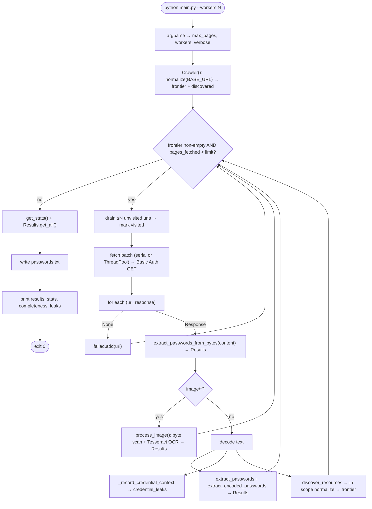

---

## 30. Final Architecture Summary

**What is this system?** A single-purpose, authenticated **BFS web crawler** that
extracts `VISUALPING{16-hex}` passwords from one challenge host and proves its own
completeness.

**Major components?** `config` (constants + regex + tracking params), `fetcher` (the only
network layer), `url_utils` (normalize/scope/resolve), `frontier` (Frontier/Visited/Results
state), `discovery` (edge extraction), `extractor` (multi-strategy password matching),
`processors.image` (optional OCR), `engine.Crawler` (orchestration + completeness), and
`main` (CLI + report).

**What data enters?** HTTP responses (HTML/JS/CSS/images/bytes) from `54.214.7.161`, plus
CLI flags.

**How does data move?** Seed URL → Frontier → authenticated fetch → content-type routing →
byte/text/image extraction (results) + reference discovery (new URLs back to Frontier),
looping until the frontier drains.

**Where is computation?** Entirely on the CPU inside CPython; C-extension hotspots are
`lxml` parsing, `re`, and `requests`/`urllib3`; optional CPU OCR via the Tesseract
subprocess.

**Where does ML inference happen?** Only classical OCR (Tesseract), and only for
pixel-rendered passwords when the optional stack is installed. No neural models, no GPU.

**Where is hardware involved?** Nowhere beyond the CPU and the optional Tesseract binary —
no sensors, GPU, FPGA, or ASIC.

**Major interfaces?** Outbound HTTP (Basic Auth), optional Tesseract subprocess, the
`passwords.txt` file, and the argparse CLI.

**Where is data stored?** In-memory sets/deque during the run; the only durable output is
`passwords.txt`.

**Major runtime flows?** Startup/seed, per-iteration fetch+process, parallel batch fetch,
image/OCR, redirect/retry recovery, and shutdown/reporting (Section 11).

**Major dependencies?** `requests`, `beautifulsoup4`, `lxml` (core); `pillow`/`pytesseract`
+ Tesseract (optional OCR); `pytest` (dev).

**Performance-critical paths?** Network fetch latency (mitigated by `--workers`) and
per-response parsing/decoding; frontier finiteness guaranteed by tracking-param stripping.

**Major architectural risks?** Live-site content rotation (currently 6/8 passwords),
plaintext credentials over HTTP, and redundant full-body multi-encoding decoding.

---

### Final validation checklist

- [x] Entire repository inspected (all first-party files; venvs excluded as non-source)
- [x] Python files inspected (main, config, `crawler/*`, `processors/*`, `tests/*`)
- [x] Entry points identified (`main.py` → `Crawler.run`)
- [x] Imports traced (acyclic; `config` leaf, `engine` root)
- [x] Major classes/functions identified (Crawler, Frontier/Visited/Results, extractor/discovery fns)
- [x] Data structures identified (deque, sets, Response, bytes/str, dict stats)
- [x] Input/output paths identified (HTTP in; `passwords.txt` + stdout out)
- [x] Hardware interfaces identified (none beyond optional Tesseract subprocess)
- [x] ML inference identified (classical OCR only)
- [x] CPU/GPU boundaries identified (CPU-only; no GPU/CUDA)
- [x] Storage identified (no DB; one flat file)
- [x] APIs identified (no inbound API; outbound HTTP + OCR)
- [x] Concurrency identified (single-thread default; optional per-batch thread pool)
- [x] Error paths identified (retries, redirect bounds, fail-soft decoders)
- [x] Deployment identified (venv, Python 3.13, no Docker/env config)
- [x] Architecture / data-flow / sequence / boundary diagrams created (16 diagrams)
- [x] Traceability matrix created
- [x] Verified/Inferred/Unknown distinctions included
- [x] `PROJECT_ARCHITECTURE.md` created in project root
```
