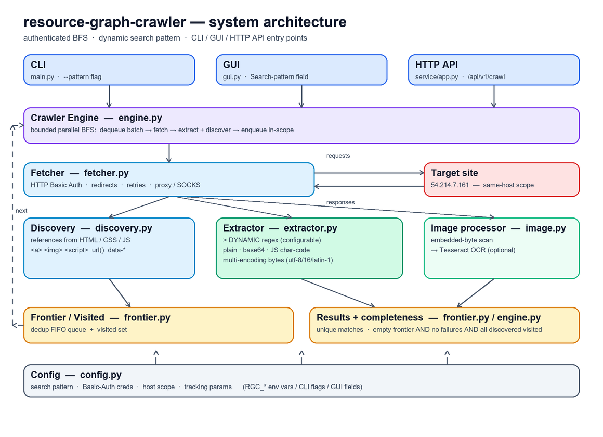
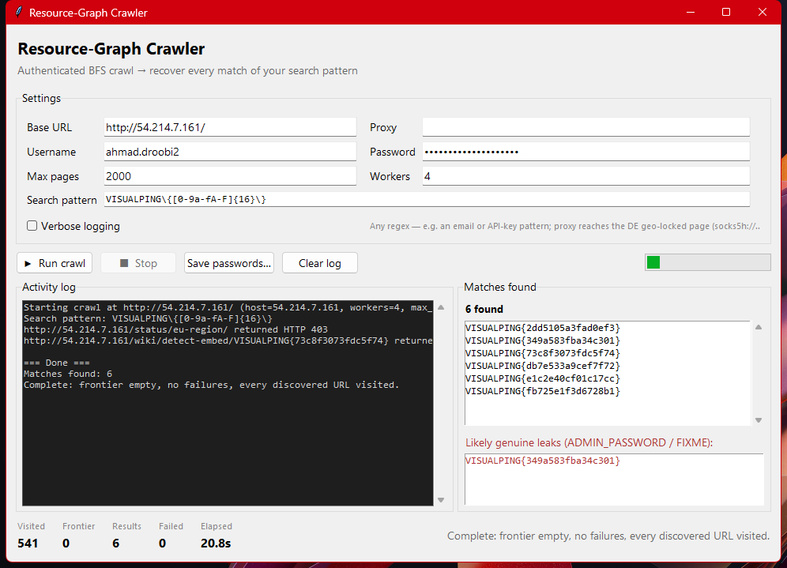

# resource-graph-crawler

An authenticated, breadth-first **resource-graph crawler**. Fetched URLs are nodes;
references discovered in HTML, scripts, CSS, comments, and binary payloads are edges.
It starts from one seed, stays on the same host (no URL guessing), and scans every
fetched resource for a **configurable search pattern**. When the frontier drains it
prints a **provable** completeness statement.

The pattern defaults to the Visualping challenge password `VISUALPING{[0-9a-fA-F]{16}}`,
but it is **not hard-coded** — point it at any regex (emails, API keys, tokens, secrets)
and the same engine hunts for that instead. One engine, three front-ends: a **CLI**, a
**desktop GUI**, and a production **HTTP API**.



---

## What it searches for — dynamic pattern

The search target is chosen at runtime; each source below overrides the default:

| Front-end | How to set the pattern |
|---|---|
| CLI | `python main.py --pattern '<regex>'` |
| GUI | the **Search pattern** field |
| API / env | `RGC_PATTERN='<regex>'` |

```bash
# default — the Visualping challenge password
python main.py

# hunt for email addresses instead
python main.py --pattern '[A-Za-z0-9._%+-]+@[A-Za-z0-9.-]+\.[A-Za-z]{2,}'

# AWS-style access-key IDs
python main.py --pattern 'AKIA[0-9A-Z]{16}'
```

Every extraction path honours the active pattern — plain text, Base64 blobs, JavaScript
`String.fromCharCode` char-code arrays, multi-encoding byte scans (UTF-8 / UTF-16 /
Latin-1), and optional image OCR. Matches use **whole-match** semantics, so a pattern
with capturing groups still returns the full match, and the documented example value is
excluded only when the default password pattern is active.

---

## Desktop GUI

A Tkinter front-end over the same engine — no extra installs (Tkinter ships with Python):

```bash
python gui.py
```



Set the seed URL, credentials, max-pages, workers, proxy, and **search pattern**;
**Run** / **Stop** a crawl on a background thread; watch live counters (visited /
frontier / results / failed / elapsed) and streaming logs; browse recovered matches and
flagged genuine leaks (`ADMIN_PASSWORD` / `FIXME` context); and save results to a file.
It reports the same provable completeness verdict as the CLI.

---

## Quick start

```bash
python -m venv .venv
source .venv/bin/activate        # Windows: .venv\Scripts\activate
pip install -r requirements.txt

# CLI — full crawl, prints a report and writes passwords.txt
python main.py --verbose --max-pages 2000 --workers 8

# Desktop GUI
python gui.py

# Local HTTP API
uvicorn service.app:app --reload --port 8000     # then open http://127.0.0.1:8000

# Tests
python -m pytest -q
```

---

## HTTP API (production control plane)

A FastAPI service exposes the crawler over HTTP. The public API is **intentionally
capped** (`RGC_API_MAX_PAGES`, default 12) — a full 2,000-page BFS belongs in Docker or
the CLI, not on a serverless timeout.

| Path | Purpose |
| --- | --- |
| `/` | Operations console |
| `/health` | Liveness |
| `/ready` | Target readiness (503 if the challenge host is down) |
| `/docs` | Interactive OpenAPI |
| `POST /api/v1/crawl` | Bounded crawl (capped for serverless) |
| `GET /api/v1/probe` | Single authenticated fetch of the seed URL |

### Docker (long-running / full crawls)

```bash
cp .env.example .env
docker compose up --build      # healthcheck hits /health; map host 8000 to the container
```

---

## Configuration

Everything is overridable by environment variable (see `.env.example`); the challenge
defaults remain for local use. Do not treat committed defaults as a secret store.

| Variable | Meaning |
|---|---|
| `RGC_BASE_URL` / `RGC_ALLOWED_HOST` | Crawl seed and host allow-list |
| `RGC_USERNAME` / `RGC_PASSWORD` | HTTP Basic Auth credentials |
| `RGC_PATTERN` | Search regex (default: the VISUALPING password shape) |
| `RGC_MAX_PAGES` / `RGC_API_MAX_PAGES` | Crawl cap (CLI/full vs. public API) |
| `RGC_API_KEY` | If set, `POST /api/v1/crawl` requires `Authorization: Bearer` |
| `VP_PROXY` / `RGC_PROXY` | Optional HTTP/SOCKS exit for geo-locked pages |

**German geo-page** (`/status/eu-region/`) is served only to a German source IP; the
server geolocates the real TCP source and ignores forwarding headers. Route through a
genuine DE exit, e.g. a Tor node forced to Germany:

```bash
# torrc: SocksPort 9050 | ExitNodes {de} | StrictNodes 1
tor -f torrc
python main.py --proxy socks5h://127.0.0.1:9050
```

---

## Architecture

The diagram above maps to the code:

| Layer | Module | Responsibility |
|---|---|---|
| Entry points | `main.py`, `gui.py`, `service/app.py` | CLI, desktop GUI, and HTTP API over one engine |
| Engine | `crawler/engine.py` | Bounded parallel BFS; cooperative stop; completeness predicate |
| Fetcher | `crawler/fetcher.py` | HTTP Basic Auth, bounded redirects, retries, proxy / SOCKS |
| Frontier / Visited / Results | `crawler/frontier.py` | Deduplicated FIFO queue, visited set, unique result set |
| Discovery | `crawler/discovery.py` | References from `<a>  <script>`, CSS `url()`, `data-*` |
| Extractor | `crawler/extractor.py` | **Dynamic-pattern** text / Base64 / char-code / multi-encoding byte scan |
| Image processor | `processors/image.py` | Embedded-byte scan, then Tesseract OCR (optional) |
| Config | `config.py` | Search pattern, auth, host scope, tracking params (env / CLI / GUI) |

**Data flow:** a URL leaves the frontier, is fetched with Basic Auth, and its body is run
through every extraction strategy while discovery mines it for new references. In-scope,
normalized, unseen references go back onto the frontier. The loop ends when the frontier
is empty.

### Provable completeness

The crawl reports itself complete only when the exact predicate in `crawler/engine.py`
holds:

```python
"complete": (self.frontier.empty and not self.failed and
             self.discovered.issubset(self.visited.as_set())),
```

In words: **the frontier is empty, no fetch failed, and every discovered in-scope URL was
visited.** Because `url_utils.normalize` strips tracking/pagination parameters, the
otherwise-unbounded `/report/?page=N` feed collapses to a single node — which is what makes
an empty frontier reachable and the completeness claim meaningful rather than a timeout.

---

## Tests

```bash
python -m pytest -q
```

17 unit tests cover URL normalization/scope, extraction (plain / encoded / multi-encoding),
discovery, and the BFS frontier. (The API tests additionally require `fastapi`.)

---

Account grouping: research first, undergraduate last — see the [profile README](https://github.com/ahmaddroobi99/ahmaddroobi99). GitHub cannot custom-sort the Repositories tab.
