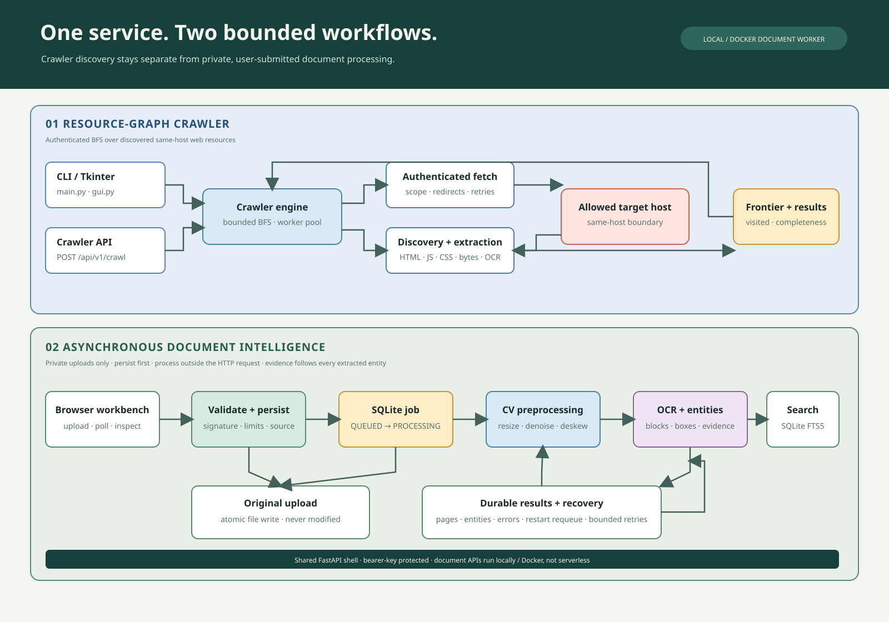

# Architecture

The repository contains two separate processing workflows, summarized in the diagram
above. The crawler traverses authenticated, discovered same-host web resources. The
Document Workbench processes only documents intentionally submitted by a user. Both are
served by FastAPI; the document worker and SQLite-backed document store are local/Docker
only and do not replace the crawler's in-memory crawl jobs.

The crawler models the website as a directed graph: fetched URLs are nodes,
and references in their bodies are edges. `fetcher.py` is the only network
layer. It sends Basic Auth, bounds redirects to the challenge host, and
returns response objects without raising on HTTP failures.

`url_utils.py` resolves references, strips fragments, and enforces the exact
host boundary. `frontier.py` owns the FIFO queue, visited set, and deduplicated
results. `discovery.py` parses HTML tags, data attributes, styles, JavaScript,
CSS, and generic quoted path strings. `extractor.py` matches only exact body
passwords; it never examines response headers.

`engine.py` performs BFS. Each dequeued URL is marked visited before fetching,
then its body is extracted and its newly discovered in-scope resources are
queued. Images receive a raw-byte scan, with OCR available when optional
libraries are installed. The crawl is complete only when the queue is empty
and `discovered <= visited`; a page limit intentionally reports incomplete
when it interrupts that condition.

## Async Document Processing

The FastAPI application also mounts a separate document API and browser workbench. The
document API validates actual PDF/PNG/JPEG contents, atomically stores originals, and
creates a SQLite document/job pair before returning. A single local/Docker background
worker renders pages, applies OpenCV preprocessing, calls Tesseract for structured OCR,
then persists blocks, evidence-backed entities, and processing errors. SQLite page
updates are incremental, so successful pages survive a later page or entity failure.

The worker restores queued/interrupted jobs on process startup and enforces the configured
attempt limit across restarts. This is a single-instance design; it is not a distributed
queue. Document APIs require a bearer key and are disabled on Vercel, whose ephemeral
storage and request lifecycle cannot satisfy these persistence/recovery requirements.
The crawler's existing API/job store remains separate. See
[`ASYNC_DOCUMENT_INTELLIGENCE.md`](ASYNC_DOCUMENT_INTELLIGENCE.md) for routes, schemas,
storage, configuration, security, and limitations.

The animated user-flow illustration is maintained by
[`../scripts/render_document_demos.py`](../scripts/render_document_demos.py) and generated
at [`images/document-workflow.gif`](images/document-workflow.gif). Its values are
illustrative; it describes contract states rather than claiming a captured OCR session.
