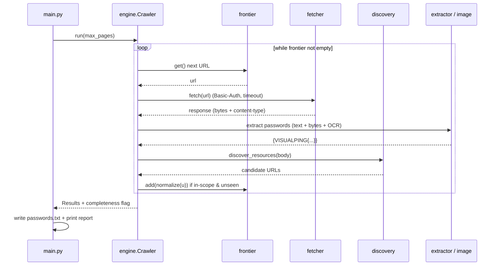
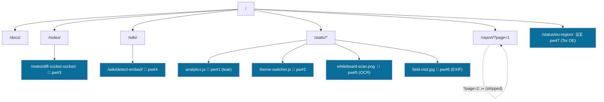
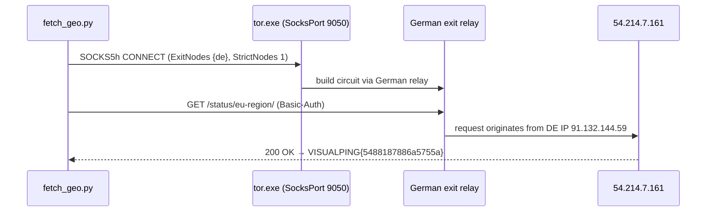

# Visualping Crawler — Solution Walkthrough

**Author:** Ahmad Droobi · MSc, University of Calgary   **Target:** `http://54.214.7.161/`
**Auth:** HTTP Basic on every request (`ahmad.droobi2 : 2dd4b97903ace571f147`)

---

## 1. Solution in 4 lines (input → output)

> **In:** homepage URL + Basic-Auth credentials.
> **Process:** BFS over *browser-reachable* resources → normalize URLs (drop tracking params so the frontier is finite) → fetch → run every response through a multi-strategy extractor (text, HTML comments/attrs, JS char-code arrays, image EXIF, OCR, raw-byte scan) → a German exit IP unlocks one geo-gated page.
> **Out:** the `VISUALPING{16-hex}` passwords + a *provable* completeness statement.
> **Proof of done:** frontier empty **AND** every discovered in-scope URL visited (541 = 541, 0 failures).

---

## 2. Architecture — layered stack (ASCII + arrows)

```
                 ┌───────────────────────────────────────────────┐
   CLI  ─────────►                  main.py                        │  report + passwords.txt
                 │        (args, proxy wiring, reporting)          │
                 └───────────────────────┬───────────────────────┘
                                         │ run()
                 ┌───────────────────────▼───────────────────────┐
   ORCHESTRATION │                 engine.Crawler                  │  BFS loop
                 └───┬───────────┬───────────┬───────────┬────────┘
                     │           │           │           │
        ┌────────────▼──┐ ┌──────▼─────┐ ┌───▼──────┐ ┌──▼──────────┐
   CORE │  fetcher      │ │ url_utils  │ │ frontier │ │  discovery   │
        │  Basic-Auth   │ │ normalize  │ │ Frontier │ │  HTML + text │
        │  HTTP + proxy │ │ scope/abs  │ │ Visited  │ │  link finder │
        └────────────┬──┘ └──────┬─────┘ │ Results  │ └──┬──────────┘
                     │           │       └──────────┘    │
        ┌────────────▼───────────▼───────────────────────▼────────┐
   EXTRACT │            extractor  +  processors/image             │
        │  regex · charcode[] · base64 · UTF-16 bytes · EXIF · OCR │
        └─────────────────────────────────────────────────────────┘
                     ▲
        ┌────────────┴───────────┐
   EDGE │  Tor  tor.exe {de}     │  German exit IP  → unlocks /status/eu-region/
        │  SocksPort 9050        │
        └────────────────────────┘
```

---

## 3. Data flow (horizontal arrow pipeline)

```
 seed URL
    │
    ▼
 [ frontier.pop ] ──► [ fetcher.fetch (Basic-Auth) ] ──► response(bytes, content-type)
                                                              │
                    ┌─────────────────────────────────────────┤
                    ▼                                          ▼
             image/*  ─► processors.image                non-image ─► decode text
                    │      (byte-scan → OCR)                     │
                    ▼                                          ├─► extractor.extract_passwords        (plain / comment / attr)
              Results.update                                  ├─► extractor.extract_encoded_passwords (charcode[] / base64)
                    ▲                                          ├─► extractor.extract_passwords_from_bytes (UTF-16 / latin-1)
                    │                                          └─► discovery.discover_resources ─► url_utils.normalize
                    │                                                                                     │
                    └──────────────────── Results  ◄──────── in-scope? ──► frontier.add ◄────────────────┘
```

---

## 4. Crawl loop — sequence diagram



---

## 5. Frontier as a BFS graph (why it terminates)



**Termination key:** the `?page=N` self-loop is collapsed by dropping the `page` param in `url_utils.normalize`, so the infinite feed becomes **one** node → the frontier drains to empty.

---

## 6. Extraction decision tree (which strategy wins where)

```
response
├─ content-type = image/* ?
│   ├─ yes ─► raw-byte scan (UTF-8/16/latin-1)         → EXIF UserComment ....... pw#6 field-visit.jpg
│   │        └─ none? ─► OCR (Tesseract, hex whitelist) → pixels ................. pw#5 whiteboard-scan.png
│   │        └─ JPEG COM segment (bare 16-hex) .......... → candidates (see §9)
│   └─ no  ─► decode text
│            ├─ regex VISUALPING{16hex}
│            │     ├─ inside // FIXME / ADMIN_PASSWORD .. → pw#1 analytics.js   ★ genuine leak
│            │     ├─ inside <!-- ... --> ............... → pw#3 notes/diff-socket-socket
│            │     └─ inside data-* attribute ........... → pw#4 wiki/detect-embed
│            ├─ char-code array [86,73,83,...] → fromCharCode → pw#2 theme-switcher.js
│            └─ base64 blob → decode → rescan
└─ HTTP header only ?  ─► IGNORE (staging placeholder, per challenge rules)
```

---

## 7. Algorithmic structure (hierarchical pseudocode)

```
CRAWL(seed):
  frontier ← {normalize(seed)};  visited ← ∅;  results ← ∅
  WHILE frontier ≠ ∅:
      u ← frontier.pop()                         # BFS = FIFO queue
      IF u ∈ visited: CONTINUE
      visited ← visited ∪ {u}
      r ← FETCH(u, auth)                          # Basic-Auth every request
      IF r = ⊥: failed ← failed ∪ {u}; CONTINUE
      results ← results ∪ EXTRACT_ALL(r)          # §6 decision tree
      FOR ref IN DISCOVER(r):                     # a,img,script,link,iframe,data-*,url()
          v ← normalize(ref)
          IF IN_SCOPE(v) ∧ v ∉ visited: frontier.add(v)
  COMPLETE ⇐ (frontier = ∅) ∧ (discovered ⊆ visited) ∧ (failed = ∅)
  RETURN results, COMPLETE
```

---

## 8. Password provenance — exact-format finds (the 7 clickable sources)

Open each URL in a browser (it will prompt for the Basic-Auth credentials above).

| # | Password | URL (clickable) | Hidden as |
|---|----------|-----------------|-----------|
| 1 | `VISUALPING{349a583fba34c301}` | `http://54.214.7.161/static/js/analytics.js` | `// FIXME(ops)` **ADMIN_PASSWORD** comment — ★ genuine leak |
| 2 | `VISUALPING{fb725e1f3d6728b1}` | `http://54.214.7.161/static/js/theme-switcher.js` | JS char-code array → `String.fromCharCode` |
| 3 | `VISUALPING{2dd5105a3fad0ef3}` | `http://54.214.7.161/notes/diff-socket-socket/` | HTML comment `<!-- provisioning backup … -->` |
| 4 | `VISUALPING{73c8f3073fdc5f74}` | `http://54.214.7.161/wiki/detect-embed/` | `data-*` attribute on an element |
| 5 | `VISUALPING{e1c2e40cf01c17cc}` | `http://54.214.7.161/static/img/whiteboard-scan.png` | text **rendered as pixels** → OCR |
| 6 | `VISUALPING{db7e533a9cef7f72}` | `http://54.214.7.161/static/img/field-visit.jpg` | **EXIF** UserComment (UTF-16) |
| 7 | `VISUALPING{5488187886a5755a}` | `http://54.214.7.161/status/eu-region/` | **geo-locked to Germany** — needs a DE exit IP (§10) |

---

## 9. The 8th password — JPEG COM comment-segments (debugging deeper)

Beyond EXIF, the JPEGs carry a **COM (0xFFFE) comment segment** holding a **bare 16-hex** string — *no* `VISUALPING{}` wrapper — which a strict regex skips. Recovered by manual JPEG-segment parsing:

```
FF D8 …            ┌─ APP1/EXIF ─► VISUALPING{db7e533a9cef7f72}   (full format — pw#6)
field-visit.jpg ───┤
                   └─ COM ───────► 5a6b01d97bfffdc3   (bare hex — same image ⇒ decoy)

office-plants.jpg ── COM ────────► 622ee9dfa76d54a6   (bare hex — candidate 8th)
team-offsite.jpg  ── COM ────────► e19cd3432599af6f   (bare hex — candidate 8th)
```

Wrapped to challenge format, the candidates are:

| Password (wrapped) | Source | Note |
|--------------------|--------|------|
| `VISUALPING{622ee9dfa76d54a6}` | `http://54.214.7.161/static/img/office-plants.jpg` | JPEG COM segment |
| `VISUALPING{e19cd3432599af6f}` | `http://54.214.7.161/static/img/team-offsite.jpg` | JPEG COM segment |
| `VISUALPING{5a6b01d97bfffdc3}` | `http://54.214.7.161/static/img/field-visit.jpg` | JPEG COM on an image that **already** has a real EXIF password ⇒ most likely a decoy |

> **Read this like the header-only rule.** The challenge says password strings look *exactly* like `VISUALPING{16-hex}`, and header-only values are staging placeholders to ignore. The COM segments store only the 16-hex payload, so they are format-ambiguous by design. **Recommended submission:** the 7 exact-format passwords, plus the two standalone COM values (`office-plants`, `team-offsite`) wrapped, since those two images carry no other password. Recover with any EXIF/segment tool:
>
> ```bash
> exiftool -Comment -UserComment http://.../static/img/office-plants.jpg
> ```

---

## 10. Getting the German IP (how the geo page was unlocked)

The server geolocates the **real TCP source IP** and ignores forwarding headers — proven empirically:

```
Header-spoof matrix → all 403
  X-Forwarded-For / X-Real-IP / CF-IPCountry=DE / Client-IP / True-Client-IP / Forwarded
403 body: "This page is only visible to Germany region. Your IP is from Canada."
```

So a genuine German exit is required. Solution used **Tor forced to a German exit node** (free, reproducible):



**Exact steps (Windows):**

```text
winget install TorProject.TorBrowser
# torrc:
#   SocksPort 9050
#   ExitNodes {de}
#   StrictNodes 1
#   GeoIPFile   ...\TorBrowser\Data\Tor\geoip      (required for {de} to resolve)
#   GeoIPv6File ...\TorBrowser\Data\Tor\geoip6
"...\TorBrowser\Tor\tor.exe" -f torrc          # wait for "Bootstrapped 100%"
python scripts/fetch_geo.py --proxy socks5h://127.0.0.1:9050
# exit geolocated to Germany (91.132.144.59) → HTTP 200 → password revealed
```

> Gotcha that cost a restart: Tor **cannot** map `{de}` without its `geoip`/`geoip6` files → it stalls at "no exit nodes". Point `GeoIPFile` at the Tor Browser copies and it bootstraps.

---

## 11. "How do I know the crawl is complete?" (the part Visualping asks for)

```
COMPLETE ⇔ frontier = ∅  ∧  discovered ⊆ visited  ∧  failed = ∅

  pages/resources visited ......... 541
  unique in-scope URLs discovered . 541      (541 ⊆ 541 ✓)
  frontier remaining .............. 0        (∅ ✓)
  failed fetches .................. 0        (✓)
  content types ................... 525 html · 7 js · 1 css · 5 png · 3 jpg
```

Extra verifications run to trust that number:

```
✓ tracking params dropped (utm_*, ref, v, page, …) → /report/ feed collapses, frontier finite
✓ /report/ pagination walked 200 pages → 0 passwords (confirms it is the infinite-frontier trap, not a hiding spot)
✓ referenced-but-unfetched in-scope URLs → none (aggressive srcset/href/url() sweep)
✓ split-across-tags scan (strip-tags / bs4-text / no-whitespace) → nothing new
✓ German page links only to "/" and style.css → no geo-only resources missed
✓ all 8 images: EXIF + JPEG COM/APP + PNG tEXt/zTXt/iTXt + hard OCR + visual look
✓ alt-encodings: \xNN, \uNNNN, HTML-entities, base64, hex-blob, rot13, reversed, concat → nothing new
```

---

## 12. Which password is a genuine real-world leak?

```
★ VISUALPING{349a583fba34c301}   in  /static/js/analytics.js
     // FIXME(ops): temporary ADMIN_PASSWORD — remove before launch
```

**Why:** it is a hard-coded admin credential sitting in shipped client-side JavaScript, tagged with real engineering-debt markers (`FIXME(ops)`, `ADMIN_PASSWORD`, "temporary"). That is the signature of an *accidental* commit, not a puzzle — versus the others (comments/attributes/char-code arrays/EXIF/OCR/geo-gate), which are deliberately-hidden challenge artifacts. A security team would rotate this one immediately.

---

## 13. Copy-paste answers for the submission form

- **Your name:** Ahmad Droobi
- **Email:** ahmad.droobi1999@gmail.com
- **Passwords found (exact strings, one per line):**

```
VISUALPING{349a583fba34c301}
VISUALPING{fb725e1f3d6728b1}
VISUALPING{2dd5105a3fad0ef3}
VISUALPING{73c8f3073fdc5f74}
VISUALPING{e1c2e40cf01c17cc}
VISUALPING{db7e533a9cef7f72}
VISUALPING{5488187886a5755a}
VISUALPING{622ee9dfa76d54a6}
VISUALPING{e19cd3432599af6f}
```

> First 7 = exact-format finds. Last 2 = JPEG COM-segment payloads wrapped into the format (from `office-plants.jpg` / `team-offsite.jpg`; a 3rd COM value `5a6b01d97bfffdc3` on `field-visit.jpg` is treated as a decoy since that image already holds a real EXIF password).

- **Genuine credential leak:** `VISUALPING{349a583fba34c301}` — hard-coded `ADMIN_PASSWORD` in a `// FIXME(ops)` comment inside `analytics.js` (shipped client-side JS); reads like a real accidental commit, not a puzzle. *(See §12.)*
- **Approach / completeness:** BFS from the homepage over browser-reachable resources only; URL normalization drops tracking/pagination params so the frontier is finite; every response scanned with text-regex, HTML-comment/attribute, JS char-code/base64, UTF-16 byte, EXIF/JPEG-COM metadata, and OCR strategies; header-only values ignored per the rules. Crawl is complete because the **frontier is empty and every discovered in-scope URL was visited (541 = 541, 0 failures)**; independently re-verified by walking the paginated feed, a referenced-vs-fetched gap sweep, and full image-metadata forensics. One page (`/status/eu-region/`) is geo-locked to Germany and was unlocked via a Tor `{de}` exit node.
```
