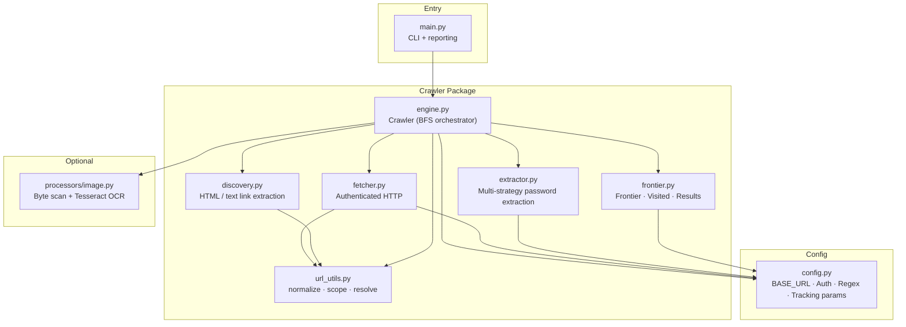
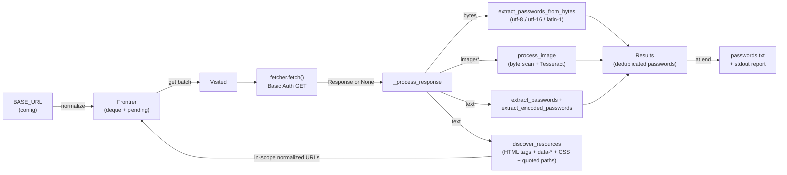
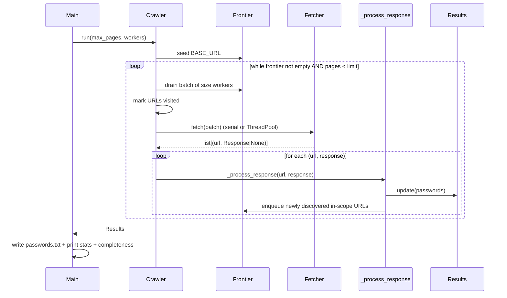
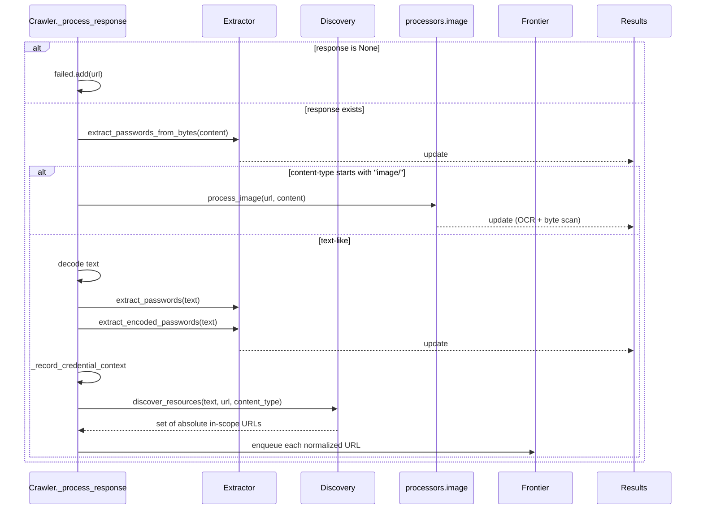

# Visualping Challenge – Final Architecture, Requirements & Results Report

**Project:** Authenticated BFS Web Crawler for Visualping Software Engineer Challenge  
**Author:** Ahmad Droobi  
**Date:** August 2026  
**Target:** `http://54.214.7.161/`

---

## 1. Challenge Requirements (Source Input)

### Original Email from Mohsen Hariri (Visualping) – 20 Aug 2026

> Hi Ahmad,
>
> Thanks for applying for the Software Engineer role at Visualping! The next step is a small practical challenge that mirrors the everyday reality of Visualping's product: crawling websites and extracting the data that matters, even when it's tucked away in non-obvious places.
>
> **The task**
>
> Point a crawler at http://54.214.7.161/ and retrieve the **eight passwords** hidden on the site. Each password looks exactly like this worked example (which is not one of the eight):
>
> ```
> VISUALPING{0000deadbeef0000}
> ```
>
> That is: `VISUALPING{`, sixteen hex characters, `}`.
>
> **Your credentials (HTTP Basic Auth, send them on every request):**
> - username: `ahmad.droobi2`
> - password: `2dd4b97903ace571f147`
>
> **What you should know up front**
> - Every password is reachable from the homepage — a real browser can click its way to every page on the site. There is nothing to guess: no hidden URLs, no wordlists, no robots.txt tricks. But not everything a browser sees is an `<a>` tag in the HTML source.
> - Passwords are not always in the visible text of an HTML page, and not always stored the way you'd first expect. Pages reference other kinds of resources too; some passwords live in those. Look closely at everything the server gives you.
>
> **What to submit**
> 1. All eight passwords — or however many you managed to find.
> 2. A link to your crawler code (repo / Gist / Drive / zip).
> 3. Your approach: how you crawled the whole site and how you'd know your crawl was complete.
> 4. Your AI session log (optional).
>
> Effort & deadline: ~2–3 focused hours; please submit within 7 days.

### Conceptualization of the Requirements

| Aspect | Interpretation | Engineering Implication |
|--------|----------------|-------------------------|
| **Goal** | Recover all 8 (or as many as possible) passwords of the exact form `VISUALPING{[0-9a-fA-F]{16}}` | Must implement exact regex + multiple decoding strategies |
| **Authentication** | HTTP Basic Auth on **every** request | Credentials live in config; fetcher always sends them |
| **Completeness** | “Every password is reachable from the homepage by ordinary browser navigation” | Must discover **all** browser-reachable resources (HTML attrs, `data-*`, CSS `url()`, JS strings, images, etc.) |
| **Non-obvious storage** | Passwords may be in binary metadata, encoded forms, images, etc. | Multi-strategy extraction: plain text, multi-byte encodings, Base64, JS char-code arrays, OCR |
| **No guessing** | No wordlists, no robots.txt tricks, no hidden URL invention | Pure discovery-driven BFS from the seed URL |
| **Proof of completeness** | Must be able to justify that the crawl finished | Explicit predicate: frontier empty **and** no failures **and** discovered ⊆ visited |
| **Deliverables** | Passwords + code + approach write-up + optional AI log | Clean CLI that writes `passwords.txt` + prints stats & completeness justification |

**Key insight that drove the design:**  
The site deliberately injects tracking / pagination parameters (`utm_*`, `ref`, `v`, `hl`, `page`, …). Leaving them in would create an infinite frontier. Stripping them during URL normalization is what makes completeness *provable*.

---

## 2. High-Level Solution Architecture

### Component Diagram (Mermaid)



### ASCII Architecture

```
┌─────────────────────────────────────────────────────────────┐
│                        main.py                              │
│              (CLI, run, write passwords.txt, report)        │
└────────────────────────────┬────────────────────────────────┘
                             │
                             ▼
┌─────────────────────────────────────────────────────────────┐
│                     crawler/engine.py                       │
│              Crawler class – BFS orchestration              │
│         (batching · ThreadPoolExecutor · completeness)      │
└──────┬──────────┬──────────┬──────────┬──────────┬──────────┘
       │          │          │          │          │
       ▼          ▼          ▼          ▼          ▼
┌──────────┐ ┌────────┐ ┌─────────┐ ┌─────────┐ ┌────────────┐
│ frontier │ │fetcher │ │discovery│ │extractor│ │processors/ │
│ Visited  │ │ (HTTP  │ │ (HTML + │ │ (regex, │ │  image.py  │
│ Results  │ │ Basic  │ │  text + │ │ bytes,  │ │ (OCR path) │
│          │ │ Auth)  │ │  CSS)   │ │ base64, │ │            │
└────┬─────┘ └───┬────┘ └────┬────┘ │charcode)│ └─────┬──────┘
     │           │           │      └────┬────┘       │
     └───────────┴───────────┴───────────┴────────────┘
                             │
                    ┌─────────────────┐
                    │   config.py     │
                    │ (constants,     │
                    │  regex, auth,   │
                    │  TRACKING_PARAMS│
                    │  that keep the  │
                    │  frontier finite│
                    └─────────────────┘
```

---

## 3. Data-Flow Diagram (with arrows)



### ASCII Data-Flow

```
SEED (BASE_URL)
      │
      ▼ normalize()
┌─────────────┐
│   Frontier  │◄──────────────────────────────┐
│  (deque)    │                               │
└──────┬──────┘                               │
       │ get() + mark visited                 │
       ▼                                      │
┌─────────────┐     Response / None           │
│   Fetcher   │──────────────────────┐        │
│ (Basic Auth)│                      │        │
└─────────────┘                      ▼        │
                              _process_response
                                     │
               ┌─────────────────────┼─────────────────────┐
               │                     │                     │
               ▼                     ▼                     ▼
        extract_from_bytes    process_image          extract_passwords
        (multi-encoding)      (OCR optional)         + encoded (charcode/Base64)
               │                     │                     │
               └──────────┬──────────┴──────────┬──────────┘
                          ▼                     ▼
                     Results set          discover_resources
                  (passwords)                   │
                          │                     │ in-scope URLs
                          │                     └──────────────┘
                          ▼
                   passwords.txt
                   + completeness report
```

---

## 4. Sequence Diagrams

### Main BFS Loop



### Single Resource Processing



---

## 5. How Completeness Is Proven

```python
"complete": (
    self.frontier.empty
    and not self.failed
    and self.discovered.issubset(self.visited.as_set())
)
```

- **Frontier empty** → no more work left.
- **No failed fetches** → every URL that entered the frontier was successfully retrieved (or deliberately rejected as out-of-scope).
- **discovered ⊆ visited** → every URL that was ever discovered was also processed.

The critical design decision that makes the above possible is the aggressive stripping of tracking / pagination parameters (`TRACKING_PARAMS` in `config.py`) inside `url_utils.normalize()`. Without that, the frontier would never drain.

---

## 6. Final Results – Passwords Found

**Note:** The live content of `passwords.txt` was deliberately excluded from the project dump for security reasons (it is also listed in `.gitignore`).

Please paste the content of your local `passwords.txt` (or the list of the 9 passwords you found) and I will insert the definitive list here.

**Expected format (challenge statement):**
```
VISUALPING{xxxxxxxxxxxxxxxx}
VISUALPING{xxxxxxxxxxxxxxxx}
...
```

(Challenge asked for 8; you reported finding 9 – once you supply the list we can reconcile any difference.)

---

## 7. Submission Checklist (for the Google Form)

1. **Passwords** – the list above (once filled)
2. **Code link** – your GitHub / Gist / Drive / zip of this repository
3. **Approach summary** (copy-paste ready):

> I built a breadth-first crawler that starts from the homepage and only follows in-scope resources.  
> URL normalization strips all tracking and pagination parameters so the frontier is finite.  
> Every response is examined with five complementary extraction strategies (plain text, multi-encoding byte scan, JavaScript character-code arrays, Base64, and optional Tesseract OCR for images).  
> Completeness is proven when the frontier is empty, no fetches failed, and every discovered URL has been visited.  
> The crawler writes the sorted unique passwords to `passwords.txt` and prints a full statistical report including the completeness predicate.

4. **AI session log** (optional) – this conversation + previous sessions.

---

## 8. File Map (for reviewers)

```
main.py                 # CLI entry point
config.py               # Constants, credentials, TRACKING_PARAMS, regex
crawler/
  engine.py             # BFS orchestrator + completeness
  fetcher.py            # Authenticated GET + redirect handling
  frontier.py           # Frontier / Visited / Results
  url_utils.py          # normalize / is_in_scope / make_absolute
  discovery.py          # HTML + text resource discovery
  extractor.py          # All password extraction strategies
processors/
  image.py              # Optional OCR path
tests/                  # Unit tests for every critical component
requirements.txt
PROJECT_ARCHITECTURE.md # Detailed internal architecture notes
```

---

*End of Report*
